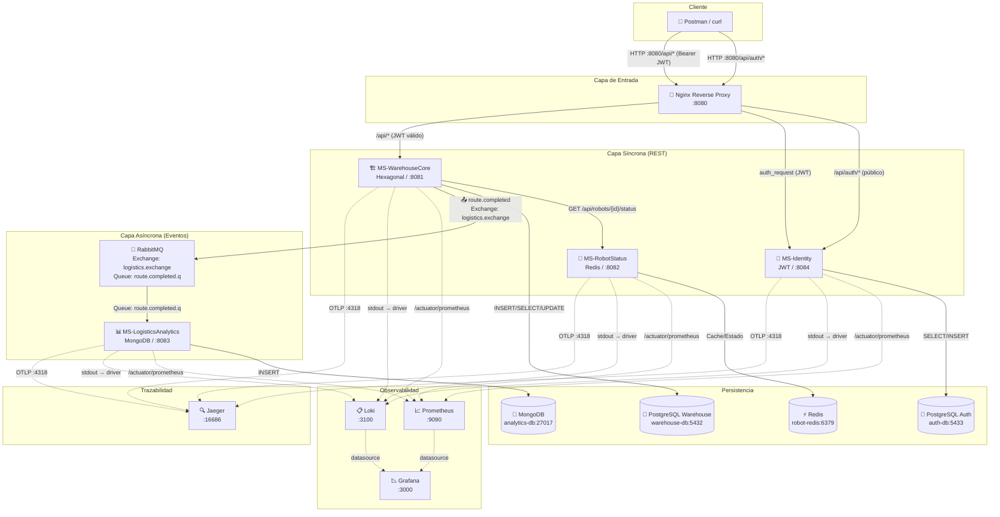
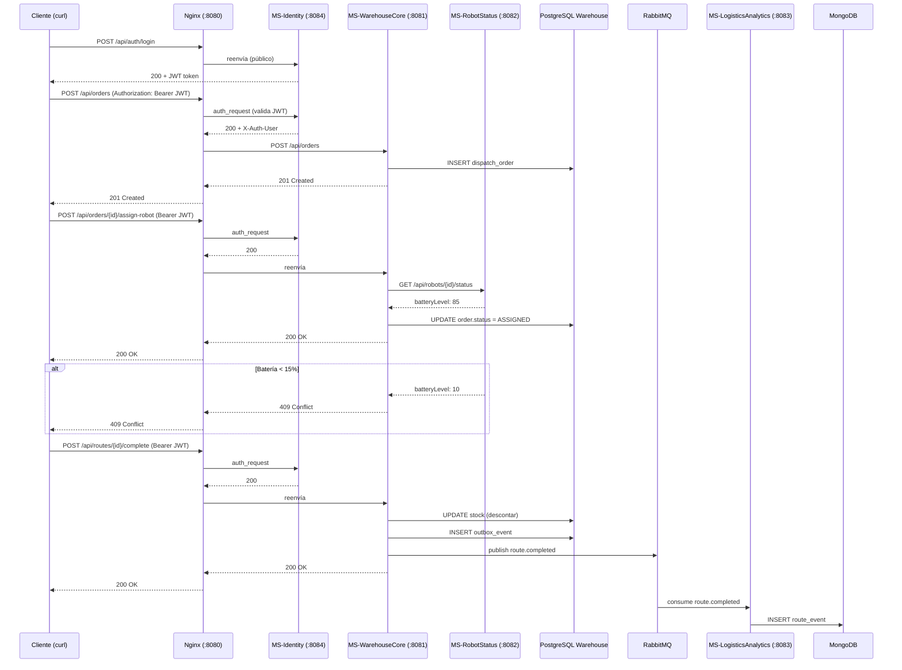

# Diagrama de Arquitectura — SmartLogistic

> Relaciones entre microservicios, bases de datos, broker y observabilidad.

## Diagrama de Contenedores (C4 Nivel 2)

## Diagrama de Secuencia — Flujo Principal

## Matriz de Comunicación entre Componentes

| Comunicación | Origen → Destino | Protocolo | Propósito |
|---|---|---|---|
| **Síncrona** | Cliente → Nginx → MS-Identity | REST HTTP | Login, register (público) |
| **Síncrona** | Cliente → Nginx → MS-Identity | REST HTTP (auth_request) | Validar JWT antes de cada request protegido |
| **Síncrona** | Nginx → MS-WarehouseCore | REST HTTP | API protegida (órdenes, inventario, rutas) |
| **Síncrona** | MS-WarehouseCore → MS-RobotStatus | REST (Feign/WebClient) | Validar batería >= 15% antes de asignar robot |
| **Asíncrona** | MS-WarehouseCore → RabbitMQ | AMQP | Publicar evento `route.completed` |
| **Asíncrona** | RabbitMQ → MS-LogisticsAnalytics | AMQP (@RabbitListener) | Consumir rutas para mapas de calor |
| **Síncrona** | MS-Identity → PostgreSQL auth-db | JDBC/JPA | Persistir usuarios |
| **Síncrona** | MS-WarehouseCore → PostgreSQL warehouse-db | JDBC/JPA | Persistir órdenes, inventario, rutas |
| **Síncrona** | MS-RobotStatus → Redis | Lettuce/Redis client | Cachear estado operativo de robots |
| **Síncrona** | MS-LogisticsAnalytics → MongoDB | Spring Data MongoDB | Persistir eventos de rutas |
| **Outbox** | MS-WarehouseCore → PostgreSQL → RabbitMQ | Patrón Outbox | Garantizar entrega del evento aunque RabbitMQ falle |
| **Trazas** | Todos los MS → Jaeger | OpenTelemetry OTLP | Trazabilidad distribuida |

## Puertos Expuestos

| Componente | Puerto host | Puerto contenedor | Visibilidad |
|---|---|---|---|
| Nginx | 8080 | 80 | Público (API) |
| MS-Identity | 8084 | 8084 | Interna (vía Nginx) |
| MS-WarehouseCore | 8081 | 8081 | Interna (vía Nginx) |
| MS-RobotStatus | 8082 | 8082 | Interna |
| MS-LogisticsAnalytics | 8083 | 8083 | Interna |
| PostgreSQL Auth | 5433 | 5432 | Interna |
| PostgreSQL Warehouse | 5432 | 5432 | Interna |
| Redis | 6379 | 6379 | Interna |
| MongoDB | 27017 | 27017 | Interna |
| RabbitMQ | 5672 | 5672 | Interna (AMQP) |
| RabbitMQ Management | 15672 | 15672 | Administrativa |
| Prometheus | 9090 | 9090 | Administrativa |
| Grafana | 3000 | 3000 | Administrativa |
| Loki | 3100 | 3100 | Administrativa |
| Jaeger UI | 16686 | 16686 | Administrativa |
| Jaeger OTLP | 4318 | 4318 | Interna (trazas) |
